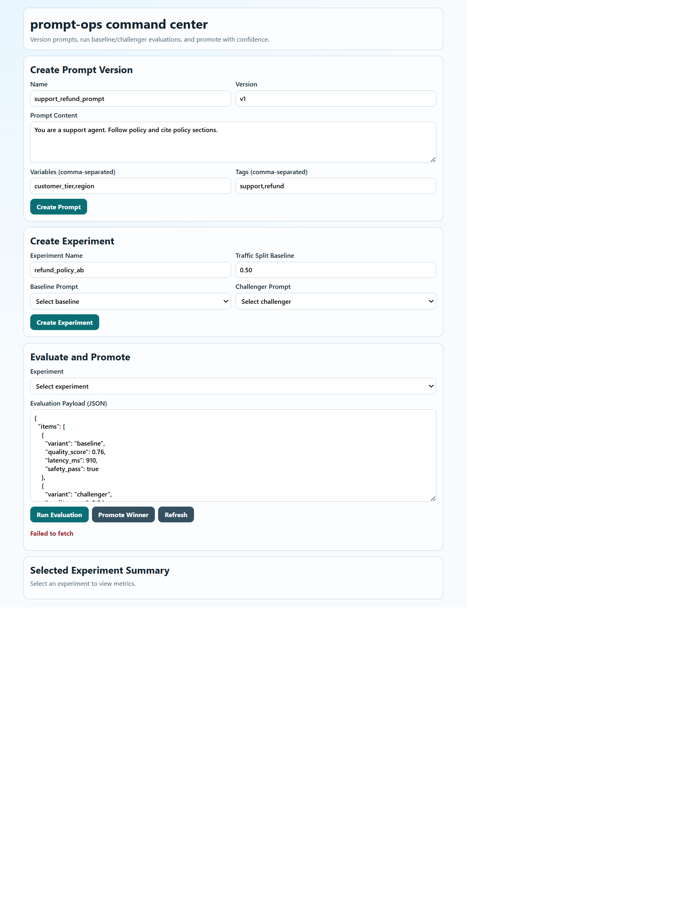

# prompt-ops

Prompt version control and A/B evaluation system for production LLM applications.

## UI Preview



## What It Does

1. Registers immutable prompt versions with metadata and variables.
2. Creates baseline vs challenger experiments with explicit traffic split.
3. Evaluates variant performance using deterministic scoring.
4. Produces promotion recommendations with audit-ready history.
5. Provides a React dashboard for prompt and experiment operations.

## Stack

- Backend: FastAPI + SQLite
- Frontend: React + Vite + TypeScript
- Deployment: Docker, Docker Compose, GitHub Actions, GHCR, GitHub Pages

## Quick Start

```bash
cp .env.example .env
cd backend
python -m venv .venv
.\.venv\Scripts\Activate.ps1
pip install -r requirements.txt
pytest -q

cd ../frontend
npm install
npm run build
```

Start full stack:

```bash
docker compose --env-file .env -f docker-compose.yml up --build
```

## APIs and Runbooks

- docs/API.md
- docs/DEPLOYMENT.md
- docs/OPERATIONS.md
- docs/FUTURE-CLARIFICATIONS.md

## Current Status

- v0.1.0 baseline: production-ready foundation
- Next: shadow traffic ingestion, rollback policies, and provider-specific judges
